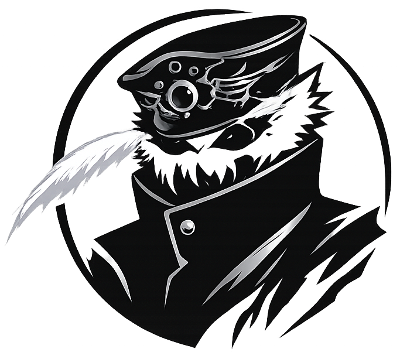
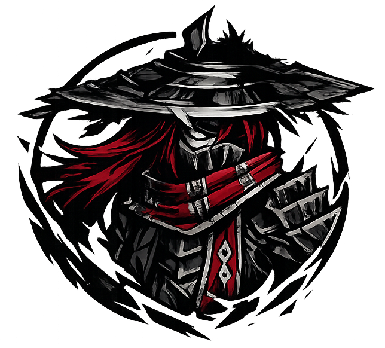
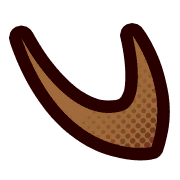
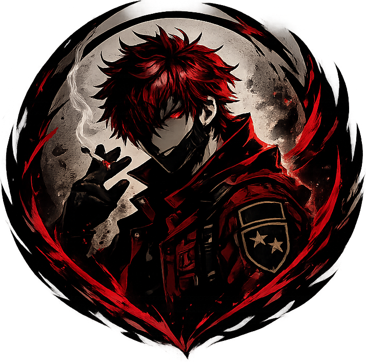

# Armas
Aqui estarão listadas as armas de cada jogador.

---

### Katar (_Axel Weber_)

#### Acerto

d10 + Proficiência + Destreza, Inteligência ou Sabedoria

#### Dano

4d4 + Destreza + Inteligência ou Sabedoria <b>[ Perfurante]</b>

#### Habilidade

Ao acertar um ataque, você pode aumentar a potência de um efeito negativo em +1 (<b><i>Máx 2x por turno, desde que seja possível</i></b>).

---

### Guan Dao (_Wuhan Xia_)

#### Acerto 

d10 + Proficiência + Força

#### Dano

2d12 + Força <b>[ Cortante]</b>

#### Habilidade

O alcance dessa arma é aumentado em +5 feet e quando um combate começa você ganha [1<u><color="#070049">Haste</color></u>]{haste} por todo o combate, ganhando um adicional também por todo o combate quando você ativar pela primeira vez [ <u><color="#070049">Berserker</color></u>]{wuhan_berserker}.

---

### Lança de Sangue (_Viktor Valenhardt_)

#### Acerto 

d10 + Proficiência + Destreza

#### Dano

2d8 + Destreza <b>[ Perfurante]</b>

#### Habilidade

Quando um aliado acertar um ataque em até 25 feet de você, você pode como ação livre também atacar esse alvo (<b><i>Máx 2x por turno</i></b>).

---

### Grande Serra Circular (_Leonard Boss_)

#### Acerto 

d10 + Proficiência + Destreza, Inteligência ou Sabedoria

#### Dano

2d10 + Destreza <b>[ Cortante]</b>

#### Habilidade

Uma vez por turno ao acertar um ataque você pode rolar d4 onde, em um resultado superior ou igual a 2 cause d6 de dano adicional e role o d4 novamente (<b><i>Máx. 4x por turno</b></i>).

---