# Combate

O combate no Sistema Moon possui algumas mecânicas adicionais:

---

### Speed
Quando um combate começa todos os seus participantes precisam fazer um teste conhecido como Speed (esse teste é definido com base na classe do personagem, mas existem meios de o alterar ou até mesmo o melhorar), que representa a ordem de ação do personagem.

---

### Ataque Extra
Um ataque comum pode ser feito com o custo de uma ação bônus.

---

### Resistências
O Sistema Moon utiliza três tipos de dano base: Cortante (Slash), Perfurante (Pierce) e Esmagante (Blunt). Com isso, cada personagem acaba possuindo resistências distintas em relação a esses três tipos de dano, desde Normal a Vulnerável.

---

### Stagger
Além dos pontos de vida, cada personagem possui uma barra de "postura", que tem seu valor definido com base na sua classe. Em resumo, quando um personagem sofre dano esse dano também é diretamente refletido na "postura" (ela também considera as resistências do personagem). 

No turno que a "postura" do personagem é quebrada e até o fim do próximo, se ele for um:

- Jogador - Todas as suas resistências são alteradas para Vulnerável.
- NPC - Todas as suas resistências são alteradas para Vulnerável e ele ganha @Immobilized por dois turnos (o em que foi atordoado e o próximo).

Note que, conforme o personagem sobe de nível o valor da "Stagger" também aumenta.

---

### Moon Points
Cada personagem possui um recurso conhecido como "Mp" (Moon Points), que serve como um recurso que é consumido para permitir o uso de Skills, E.G.O, Armas Únicas e até mesmo itens especiais.

Os Mp possuem um valor base de 3, mas esse valor também é aumentado conforme os níveis do personagem aumentam.

- Quando um combate começa: Todos os personagens ganham Mp igual ao seu Mp base. 
- Quando o turno de um personagem termina: Ele recupera 1 Mp.
- Quando um personagem sofre Stagger ou Morre: O atacante recupera todo o seu Mp. 

---

### Reações de Combate
Os personagens possuem acesso a algumas reações adicionais:

- 
 <b>Defender:</b>  Como reação a sofrer um ataque você pode entrar em uma postura defensiva e reduzir qualquer dano sofrido por você em 5 + Seu Nível.

- 
 <b>Contra Ataque:</b> Como reação a sofrer um ataque você pode tentar contra atacar seu atacante, desde que você possua alcance.

- 
 <b>Evadir:</b> Como reação a sofrer um ataque você pode tentar se esquivar, essa esquiva é um salvaguarda de destreza com DC equivalente ao acerto do ataque.

- 
 <b>Clash</b> Como reação a você ou um aliado em até 5 feet sofrer um ataque, você pode redirecionar o ataque para você e ativar um clash, onde ambos irão realizar um ataque, onde quem tiver o maior resultado ganha esse clash, causando dano crítico em quem perdeu.

---

### Skills

Cada Personagem possui acesso a uma série de habilidades únicas, conhecidas como Skills que aplicam efeitos distintos, e melhoram a proficiência do personagem em combate. Elas são divididas da seguinte forma:

#### - Attack Skills -

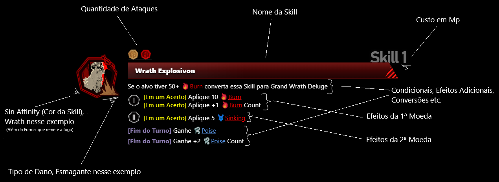

Existem um total de 3 Attack Skills (ignorando Attack Skills especiais), que custam uma ação (essa regra é ajustada ao chegar no nível 30) e Mp para serem utilizadas (Custo do Mp definido com base no nível da Skill).

Todas as moedas (ataques) de uma Skill, são feitos no mesmo alvo.
 
 

#### - Passives -

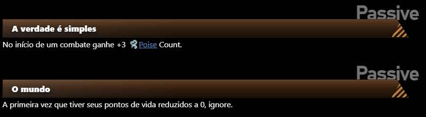

 
 

#### - Defense Skill -

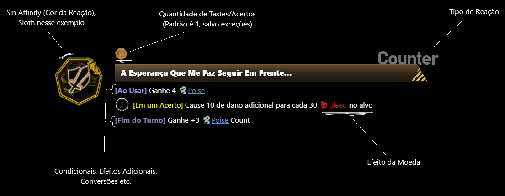

Uma Defense Skill substitui uma das quatro reações de combate, para uma versão melhorada que possui sinergia com o kit do personagem.

---

### Armas
Na interface das Attack Skills e algumas Defense Skills, temos a presença de moedas acima do nome da Skill, que já fora explicada que representa um ataque.

O ponto é que esse ataque é feito com base no uso de uma arma base, que não possua afinidade com nenhum pecado (Verificar sessão Sin Affinity's).

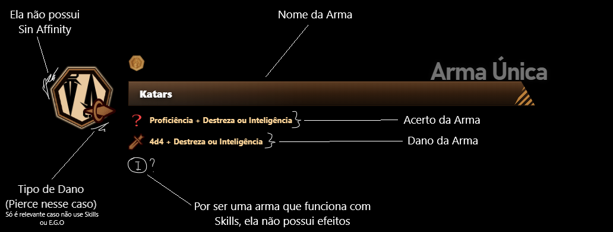

Existem também armas que possuem afinidade com algum pecado, que custam Mp para serem utilizadas e não podem ser utilizadas com Skills (pois já funcionam como Skills).

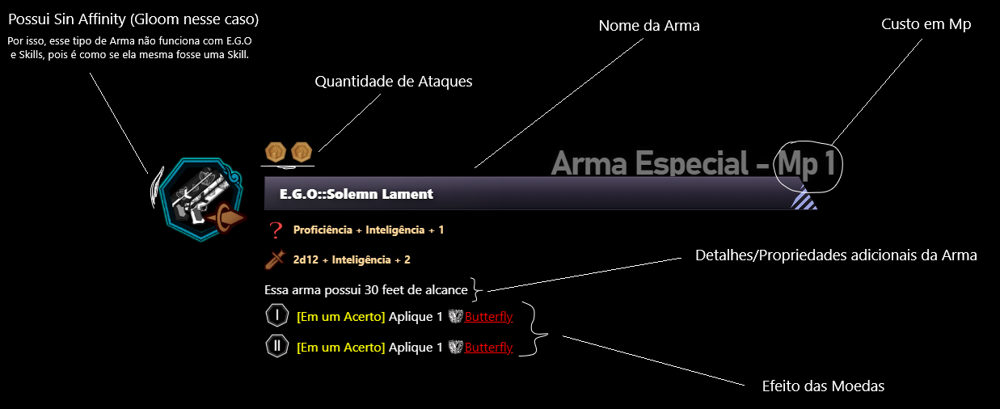

---

### Sin Affinity's 
Cada Skill, E.G.O e Arma Especial possui um Sin (pecado) vinculado. No fim do turno, você recebe 1 Sin Affinity para cada Skill, E.G.O e arma especial utilizada, do Sin respectivo, esses Sin são recursos que são consumidos para permitir o uso de E.G.O.

<h4>Wrath (Ira)</h4>

<h4>Lust (Desejo)</h4>
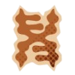

<h4>Sloth (Preguiça)</h4>
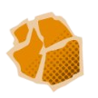

<h4>Gluttony (Gula)</h4>

<h4>Gloom (Tristeza)</h4>

<h4>Pride (Orgulho)</h4>

<h4>Envy (Inveja)</h4>

---

### E.G.O
Alguns poucos personagens possuem acesso a uma habilidade única conhecida como E.G.O (Exterminação de Orgão Geométrico), que precisa de uma certa maestria para ser utilizada, e é dividida nos seguintes riscos (quanto mais alto, mais forte e perigoso é):

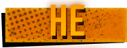

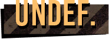

O E.G.O só pode ser utilizado uma vez por turno, com o custo de uma ação, 3 Mp e algumas Sin's. O E.G.O possui duas formas distintas:

#### - Awakening -

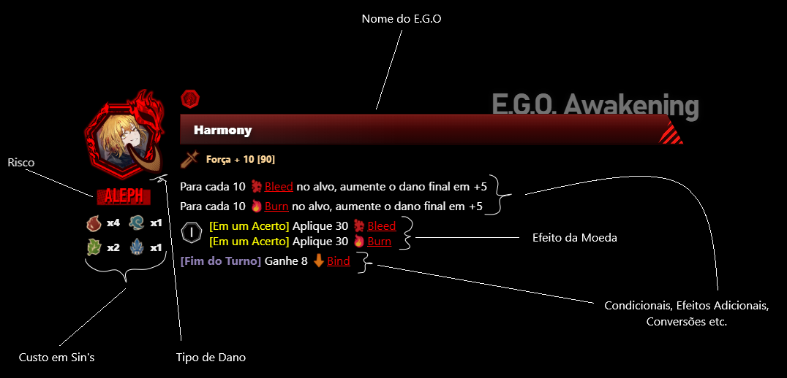

 
 

#### - Corrosion -

Ao usar o 'E.G.O Corrosion' faça um teste de sanidade, com base no resultado existe a chance de você perder o controle temporariamente (a margem aumenta conforme o risco do E.G.O) ou atacar aliados. Note que E.G.O de risco Zayin é o único que foge a essa regra (salvo exceções, que envolvem acontecimentos na mesa).

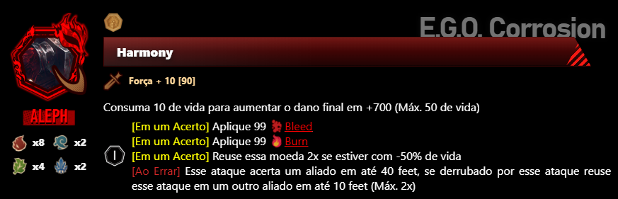

 

#### - Passives -
Ao utilizar o E.G.O pela primeira vez, você ganha acesso a essa passiva (Awakening ou Corrosion) por todo o combate.

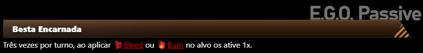

---

### Teste de Sanidade

Se trata de um d100 que possui uma margem de erro que aumenta conforme o peso mental que ela carrega. Para um exemplo mais claro, no caso do uso de um E.G.O de risco Teth, o teste necessitaria que d100 > 5 para nada acontecer (lembre-se a penalidade não é fixa e sempre aumenta dinâmicamente).

---